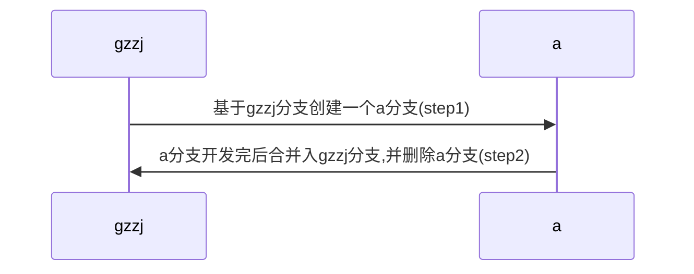

# git

## git 缩写配置
- 在home目录创建.gitconfig文件复制粘贴以下配置并保存退出

```
[user]
  name = xx
  email = xx@qq.com
[color]
  interactive = auto
  diff = auto
  status = auto
  branch = auto
  ui = true
  repositoryformatversion = 0
  filemode = true
  bare = false
  logallrefupdates = true
  ignorecase = true
  precomposeunicode = false

[alias]
  co = checkout
  ci = commit
  st = status
  sh = stash
  sa = stash apply
  sp = stash pop
  ap = add -p
  br = branch
  cp = checkout -p
  cv = commit -v
  dc = diff --cached
  d = diff
  pr = pull --rebase
  ps = push
  l = log --graph --pretty=format:'%C(yellow)%h%Creset %C(yellow)%d%Creset %s %Cgreen(%cr) %C(bold blue)<%an>%Creset' --abbrev-commit --date=short --all
  lg = log --color --graph --pretty=format:'%Cred%h%Creset -%C(yellow)%d%Creset %s %Cgreen(%cr) %C(bold blue)<%an>%Creset' --abbrev-commit --all
[hub]
  protocol = https
[diff]
  tool = vimdiff
[core]
  editor = vim
```

## 常用缩写
```
git co
git br
git ci
git lg
```

## 工作流
1. 开发新功能a


```
step1:
git br a gzzj
git push origin a

step2:
git co gzzj
git pull
git co a
git merge gzzj
git push

git co gzzj
git merge a
git push
git br -D a
```

## 常用命令
- 删除远程分支a:
  - 切换到本地其它分支,如master
```
git co master
```
  - 删除远程分支
```
git push origin --delete a
```

- 修改远程分支地址
```
git remote -v
git remote rm origin
git remote add origin git@gitee.com:cfanzp/linux_note.git
```

## 删除所有历史commit,创建一个新仓库
1. Checkout
```
   git checkout --orphan latest_branch
```

2. Add all the files
```
   git add -A
```

3. Commit the changes
```
   git commit -am "commit message"
```

4. Delete the branch
```
   git branch -D master
```

5. Rename the current branch to master
```
   git branch -m master
```

6. Finally, force update your repository
```
   git push -f origin master
```
