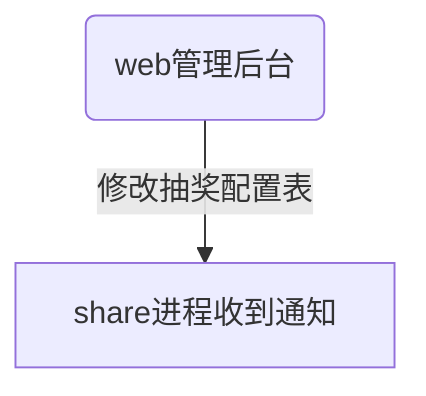
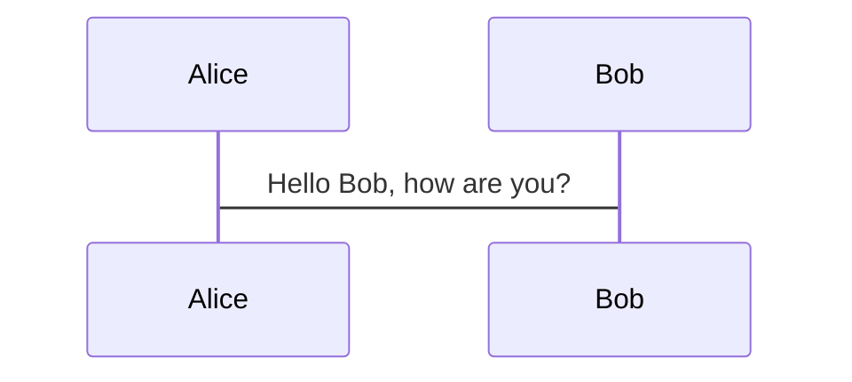
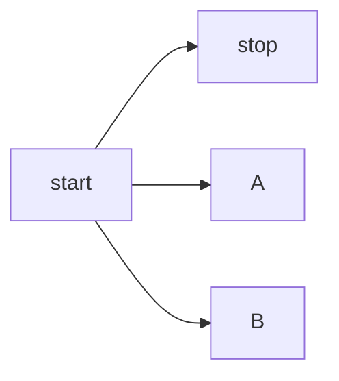

# mermaid

## 介绍
- 官网：https://mermaidjs.github.io/
- Github 项目地址：https://github.com/knsv/mermaid

## 使用
- Mermaid 支持多种图表的方向，语法如下：
```
graph 方向描述
    图表中的其他语句...
```

- 符号

用词 | 含义
:--  | :--
TB   | 从上到下
BT   | 从下到上
LR   | 从左到右
RL   | 从右到左


- 结点含义

表述       | 含义
:--        | :--
id[文字]    | 矩形节点
id(文字)   | 圆角矩形节点
id((文字)) | 圆形节点
id>文字]   | 右向旗帜状节点
id{文字}   | 菱形节点

- 节点间的连线

表述     | 说明
:--      | :--
>        | 添加尾部箭头
-        | 不添加尾部箭头
--       | 单线
--text-- | 单线上加文字
==       | 粗线
==text== | 粗线加文字
-.-      | 虚线
-.text.- | 虚线加文字

- eg
```
web修改数据库表配置--->通知share进程--->通知cn进程--->通知lobby进程--->luckydraw_agent服务reload相关表--->通知agent--->通知客户端
```




```mermaid
graph TB start-->stop
```




## 帮助
- [mermaid实用教程](https://blog.csdn.net/fenghuizhidao/article/details/79440583)
- [mermaid简介](https://season.blog.csdn.net/article/details/52887045)
